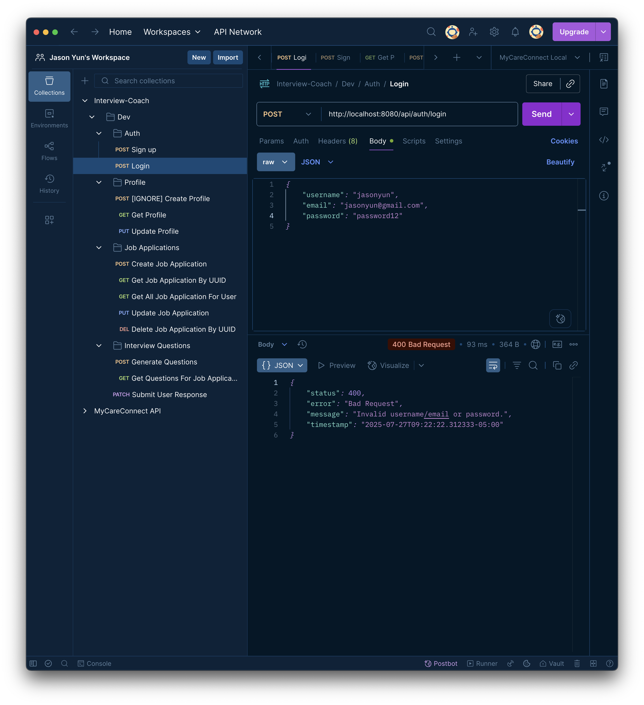
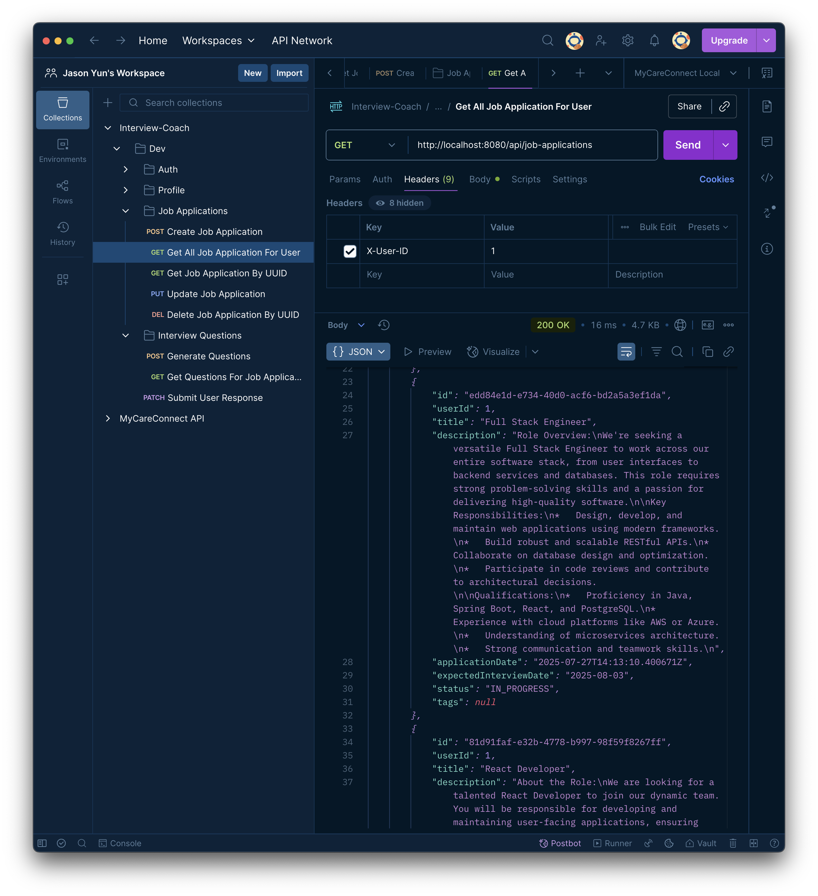

## Entity-Relationship-Diagram

## Render.com Deployment

https://interview-coach-backend-slvr.onrender.com

## List of all endpoints tested in Postman:

### Authentication Endpoints (Render.com Deployment)

1. POST /api/auth/signup - User registration
   

2. POST /api/auth/login - User login
   

3. GET /api/users/{userId}/profile - Get user profile
   

4. PUT /api/users/{userId}/profile - Update user profile
   

5. POST /api/job-applications - Create job application
   

6. GET /api/job-applications - Get all job applications for user (user ID provided via X-User-ID in header)
   

7. GET /api/job-applications/{jobAppId} - Get specific job application by its UUID and X-User-ID through header (each
   user can only view their own job applications)
   

8. PUT /api/job-applications/{jobAppId} - Update job application with UUID and X-User-ID
   

9. DELETE /api/job-applications/{jobAppId} - Delete job application (X-User-ID provided in header to ensure each user
   can only delete their own job applications)
   

10. POST /api/job-applications/{jobAppId}/questions/generate - Use the power of AI to generate practice interview
    questions
    

11. GET /api/job-applications/{jobAppId}/questions - Get questions for a specific job application that belongs to the
    current user (X-User-ID)
    

12. PATCH /api/job-applications/{jobAppId}/questions/{questionId}/respond - User submits their response to an interview
    question in a specific job application and get AI feedback (X-User-ID to verify user identity)
    

13. Actuator Health
    

### Authentication Endpoints (Localhost)

1. POST /api/auth/signup - User registration
   
   

2. POST /api/auth/login - User login
   
   

### Profile Endpoints

3. POST /api/users/{userId}/profile - Create profile (won't work since auto-created. User will have to use PUT to update
   their profile instead)
   

4. GET /api/users/{userId}/profile - Get user profile
   
   
   

5. PUT /api/users/{userId}/profile - Update user profile
   
   

### Job Application Endpoints

6. POST /api/job-applications - Create job application
   
   

7. GET /api/job-applications - Get all job applications for user (user ID provided via X-User-ID in header)
   
   
   

8. GET /api/job-applications/{jobAppId} - Get specific job application by its UUID and X-User-ID through header (each
   user can only view their own job applications)
   
   

9. PUT /api/job-applications/{jobAppId} - Update job application with UUID and X-User-ID
   
   

10. DELETE /api/job-applications/{jobAppId} - Delete job application (X-User-ID provided in header to ensure each user
    can only delete their own job applications)
    
    

### Interview Question Endpoints

11. POST /api/job-applications/{jobAppId}/questions/generate - Use the power of AI to generate practice interview
    questions
    
    

12. GET /api/job-applications/{jobAppId}/questions - Get questions for a specific job application that belongs to the
    current user (X-User-ID)
    
    

13. PATCH /api/job-applications/{jobAppId}/questions/{questionId}/respond - User submits their response to an interview
    question in a specific job application and get AI feedback (X-User-ID to verify user identity)
    
    

*Note*: Remember to include the X-User-ID header in all requests (except auth endpoints) for user authorization.

## Test Results

### JobApplication Controller Tests

### JobApplication Service Tests

## AOP - Logging in console and in external file

## Spring Actuator Health (Localhost)

## Spring Actuator Health (Render.com deployment)

